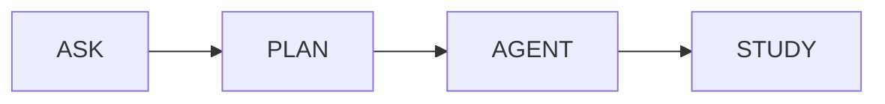

# 🚀 AI Copilot for Software Engineering

Um **Copiloto de Inteligência Artificial multi-modo** projetado para auxiliar desenvolvedores em todo o ciclo de desenvolvimento: **entender, planejar, implementar e aprender**.

> 💡 Mais do que um assistente, este projeto propõe um **sistema de engenharia assistida por IA com controle de autonomia progressiva**.

---

## 🧠 Visão Geral

Este projeto explora o uso de IA como um **copiloto técnico**, capaz de atuar em diferentes níveis:

* Diagnóstico de problemas
* Planejamento de soluções
* Implementação de código
* Ensino de conceitos

A abordagem é baseada em **modos especializados**, cada um com um papel claro dentro do fluxo de desenvolvimento.

---

## 🧩 Modos do Copiloto

### ❓ Ask — Diagnóstico (Read-only)

Modo focado em **análise e entendimento**.

* Explica erros e stack traces
* Analisa código
* Sugere abordagens
* **Não modifica código**

👉 Ideal para debugging e investigação

---

### 🧭 Plan — Planejamento

Modo responsável por **estruturar soluções antes da execução**.

* Define arquitetura
* Lista passos incrementais
* Identifica riscos e trade-offs
* Planeja testes e validação
* **Não gera código completo**

👉 Funciona como um mini design document automático

---

### 🤖 Agent — Execução

Modo mais avançado: **implementa código completo**.

* Cria e modifica arquivos
* Implementa features end-to-end
* Inclui validações e testes
* Segue boas práticas de engenharia

👉 Atua como um desenvolvedor dentro do projeto

---

### 📚 Study — Aprendizado

Modo focado em **ensinar e desenvolver conhecimento técnico**.

* Explicações progressivas (básico → avançado)
* Analogias e exemplos práticos
* Destaque de trade-offs e armadilhas
* Checkpoints de compreensão

👉 Funciona como um tutor técnico

---

## 🔄 Fluxo Inteligente

O grande diferencial do projeto é o pipeline:



### Como funciona na prática:

1. **ASK** → entende o problema
2. **PLAN** → define a solução
3. **AGENT** → implementa
4. **STUDY** → consolida o aprendizado

---

## ⚙️ Stack Padrão

* **Node.js + TypeScript**
* Express (ou adaptável)
* Jest / Vitest (testes)
* ESLint + Prettier
* APIs REST

---

## 🏗️ Arquitetura

```
/copilot
  /prompts
    prompt-ask.md
    prompt-plan.md
    prompt-agent.md
    prompt-study.md
  /core
    orchestrator.ts
    context-manager.ts
    response-formatter.ts
  /examples
```

### Componentes principais:

* **Orchestrator** → seleciona o modo e injeta prompts
* **Context Manager** → entende o projeto e mantém contexto
* **AI Engine** → gera respostas e código
* **Executor** → aplica mudanças (Agent mode)
* **Formatter** → padroniza respostas

---

## 🧪 Casos de Uso

### 🔹 Debugging

* ASK analisa erro
* AGENT sugere correção

### 🔹 Nova Feature

* PLAN estrutura solução
* AGENT implementa

### 🔹 Refatoração

* ASK identifica melhorias
* PLAN organiza mudanças
* AGENT executa

### 🔹 Aprendizado

* STUDY ensina conceitos e boas práticas

---

## ⚠️ Controle de Risco

| Modo  | Risco    | Descrição         |
| ----- | -------- | ----------------- |
| Ask   | 🟢 Baixo | Não altera código |
| Plan  | 🟡 Médio | Requer validação  |
| Agent | 🔴 Alto  | Executa mudanças  |
| Study | 🟢 Baixo | Educacional       |

---

## 📊 Métricas de Sucesso

* Tempo de entrega de features
* Redução de bugs
* Uso de PLAN antes do AGENT
* Qualidade do código gerado
* Evolução técnica do time

---

## 🚀 Roadmap

### Fase 1

* Ask + Agent
* Interface básica

### Fase 2

* Plan
* Context awareness

### Fase 3

* Study
* Sugestão automática de modo

### Fase 4

* Integração com IDE (VS Code)
* Execução real de código
* CI/CD integration

---

## 🧠 Diferencial

Este projeto se destaca por:

* Combinar **análise, planejamento e execução**
* Controlar o nível de autonomia da IA
* Estruturar respostas com padrão de engenharia
* Promover aprendizado contínuo

---

## 📌 Conclusão

O **AI Copilot for Software Engineering** transforma a IA em um:

> 🤝 Parceiro real de desenvolvimento

Unindo produtividade, qualidade e aprendizado em um único sistema.

---

## 🤝 Contribuição

Contribuições são bem-vindas!

1. Fork o projeto
2. Crie uma branch (`feature/nova-feature`)
3. Commit suas mudanças
4. Abra um Pull Request

---

## 📄 Licença

Este projeto está sob a licença MIT.

---

## 👨‍💻 Autor

Desenvolvido como projeto de estudo e inovação em engenharia de software com IA.
